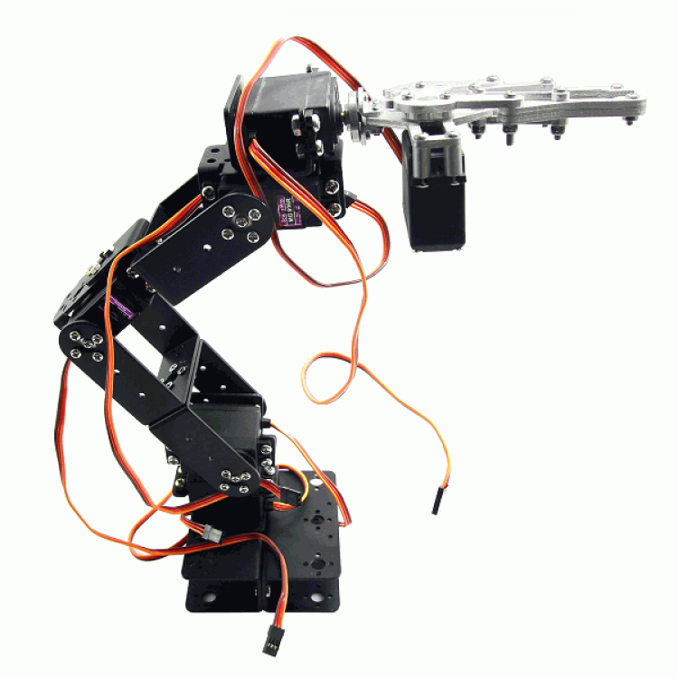
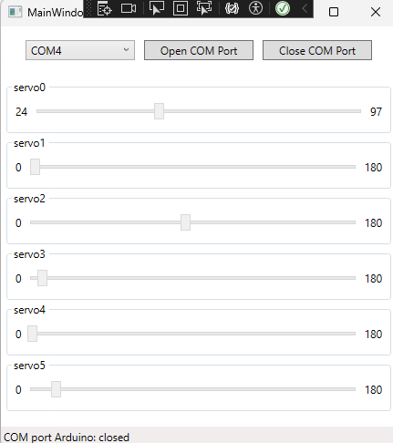

# 6-DOF-Robotic-Manipulator-Arduino-Python

  

Servos MG996R drive all the joints of the robot.

## Getting Started

To get started with the 6-DOF robot control system, follow these steps:

1. Clone the repository to your local machine.
2. Install the arduino Ide.
3. Install Python (3.10.X) and QtPy5
4. Understand the code structure and functionality.
5. Load the provide code to the board.
6. If you want to change GUI design you need to download Qt Designer (free)

# Repository Index
* [sketch](https://github.com/karelkalata/6-DOF-Robotic-Manipulator-Arduino-Python/tree/main/Arduino) - sketch for Arduino IDE
* [GUI Python](https://github.com/karelkalata/6-DOF-Robotic-Manipulator-Arduino-Python/tree/main/Python) - source files of Python
* [GUI C#](https://github.com/karelkalata/6-DOF-Robotic-Manipulator-Arduino-Python/tree/main/CSharp) - source files of C#

# Added visualization of slider minimum and maximum values

  

## License

This project is licensed under the [MIT License](LICENSE.md) - see the [LICENSE.md](LICENSE.md) file for details.